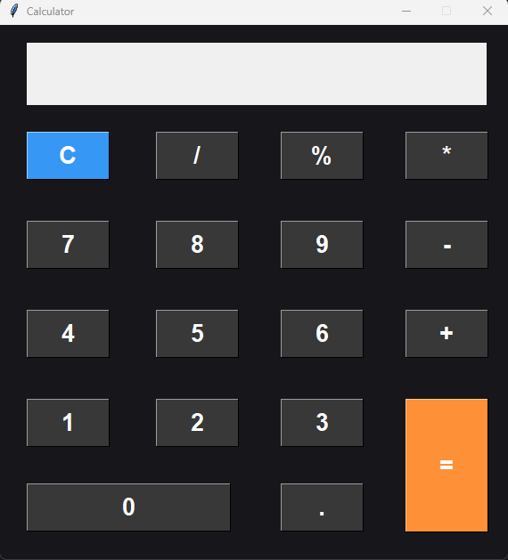

🧮 Calculator App - Python Tkinter
Une application de calculatrice simple et élégante développée en Python avec l'interface graphique Tkinter.

📸 Capture d'écran

🚀 Fonctionnalités
✅ Interface graphique moderne avec Tkinter
✅ Opérations de base : +, -, *, /, %
✅ Effacer toute l'expression (C)
✅ Affichage dynamique des calculs
✅ Bouton = pour afficher le résultat
✅ Interface responsive avec des couleurs personnalisées
✅ (Optionnel) Support des touches clavier

🛠️ Technologies utilisées
Python 3.x

Tkinter (intégré dans Python, aucun besoin d’installation supplémentaire)

▶️ Lancement de l'application
Cloner ce dépôt :
  git clone https://github.com/Frejuste26/calculatrice.git
  cd calculatrice-python

Lancer l'application :
  python calculator.py

💡 Assure-toi d’avoir Python installé sur ta machine.

📁 Arborescence
calculatrice/
│
├── calculator.py       # Fichier principal contenant tout le code
├── README.md           # Ce fichier
└── screenshot.png  # Capture de l'application

📃 Licence
Projet open-source sous licence MIT.
Libre à toi de l’utiliser, le modifier et le partager !

🤝 Auteur
Développé avec ❤️ par Kei Prince Frejuste
📧 keifrejuste26@gmail.com.com
🌐 LinkedIn — Portfolio

